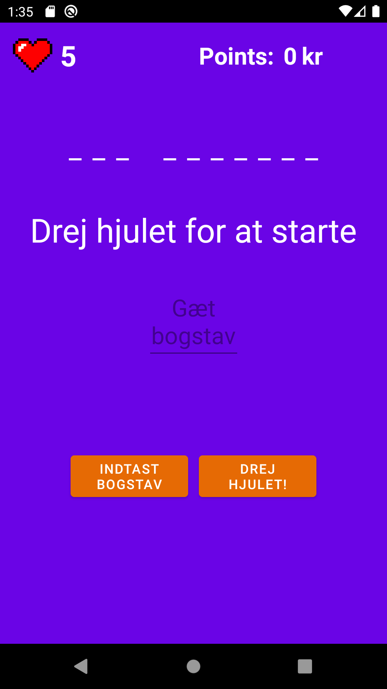

# Lykkehjul_v2

# Der er implementeret recyclerview for word/phrases. Dette er dokumentationen for det er anvendt.

## Version 2
Grunden til jeg har lavet en version 2 er fordi jeg var blevet færdig med hele spillet, men manglede en navigation component. 
Derfor er alle mine commits ikke i denne repository

## How to play
Man starter spillet ved at trykke på 'start spil'-knappen, her bliver man taget til selve spillet. Der bliver valgt et tilfældigt ord fra kategorien.
Man skal trykke på drej hjulet for at få et outcome af hjulet, dernæst trykker man på editText og indtaster et vilkårligt bogstav som man vil gætte. Når man har valgt et bogstav skal man trykke på den knap som lukker tastaturet, og bagefter trykkes på 'indtast bogstav'-knappen. Sådan fortsætter spillet indtil man vinder eller taber.

